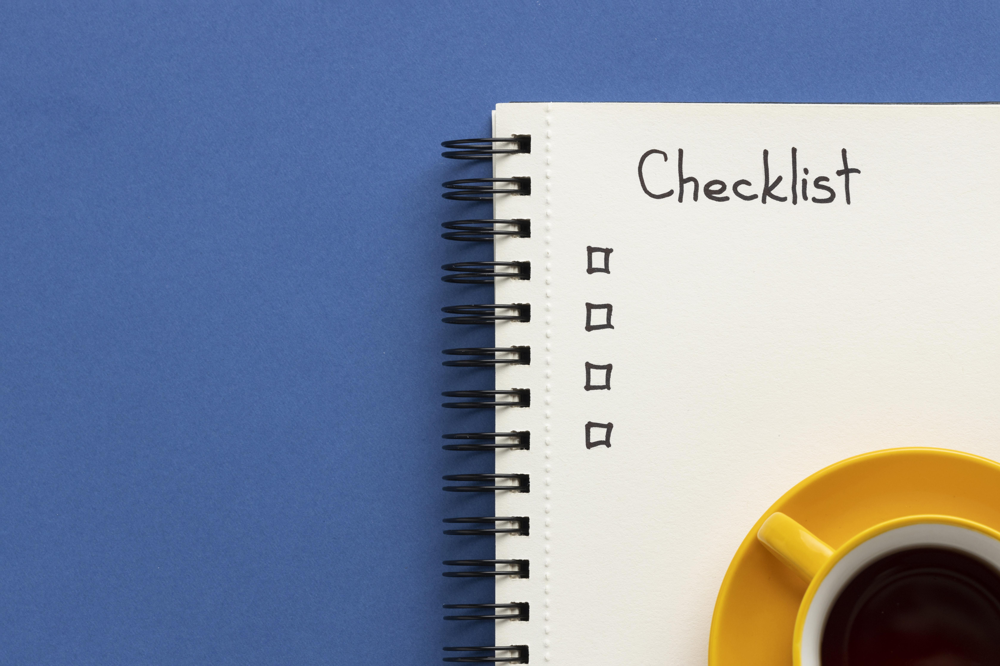

Nas ultimas semanas de trabalho obtivemos avanço significativo e aqui vai uma lista de algumas coisas que conseguimos fazer:

## Melhorias
- Melhorias relacionadas aos Scripts.
- Melhorias de organização.
- Melhorias e implementações na interface de usuário.
- Realizados diversos testes de funcionamento e implementações.
- Primeiros testes realizados em ambiente android.
- Realizados testes e estudos de uso para implementação de mecanicas dos interiores.
- Realizados diversas melhorias relacionadas aos tilemaps, palletes e mapa.

## Implementações
- Criada documentação do projeto para compartilhamento de conhecimento e informações.
- Criado e documentado sistema de gerenciamento e mapeamento dos assets e paths.
- Adicionado sistema de posicionamento e disposição dos elementos da interface por meio do editor.
- Adicionado movimentação por meio de joystick.
- Adicionado e configurado diversos parametros de build e teste em ambiente android.
- Implementado sistema de adição de propriedades dos items e sua devida documentação de uso e funcionamento.

## Correções
- Corrigido erros de importação.
- Corrigidos alguns erros do mapa.
- Corrigidos aspectos de física, movimentação e colisão.
- Corrigidas diversas falhas relacionadas ao minimapa.

## Trabalhos em progresso
- Mecanicas de interiores. 
- HUD e UI (User Interface) 
